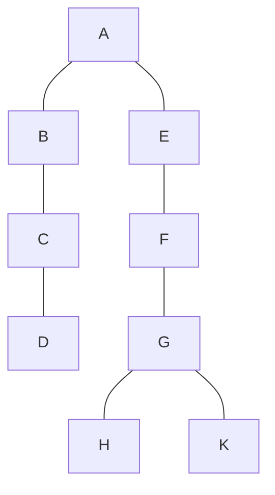
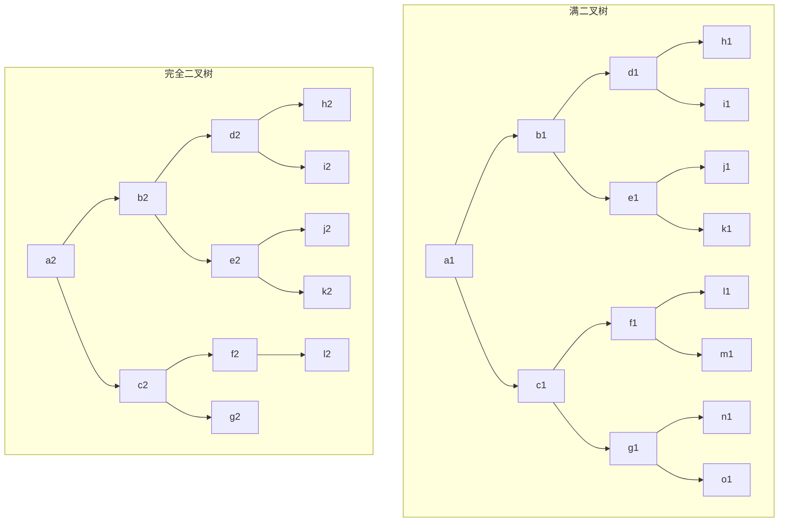
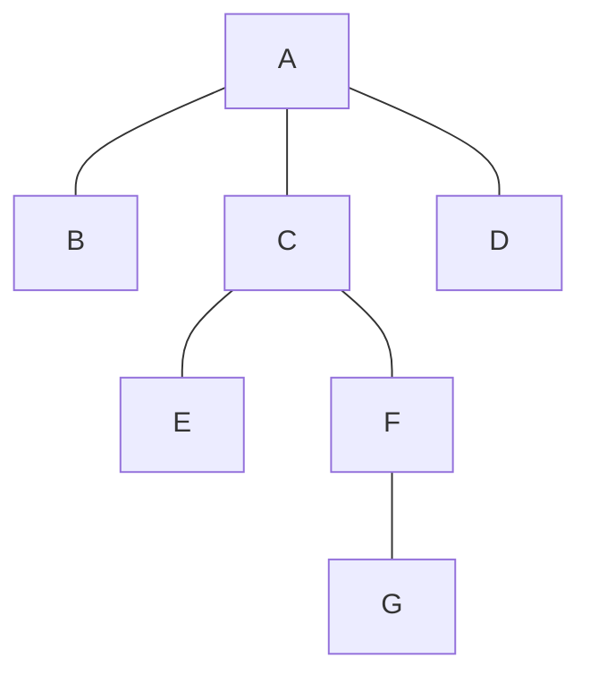
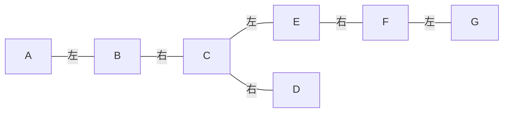
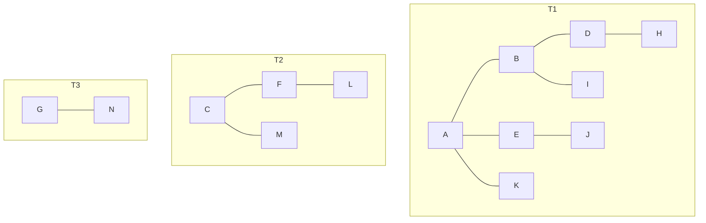
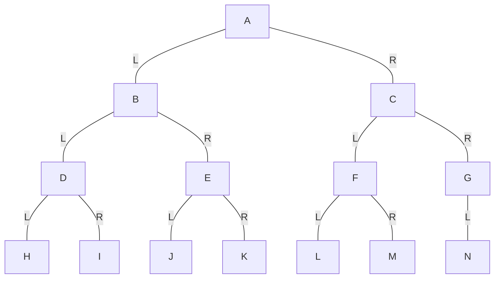

# 目录

[TOC]

<!-- more -->

# 6.1 树的类型和定义

## 基本术语

- 结点：数据元素+若干指向子树的分支

- 结点的度：分枝的个数

- 树的度：树中所有结点的度的最大值

- 叶子结点：度为零的结点

- 分支结点：度大于零的结点

- 从根到结点的路径：由从根到该结点所经分支和结点构成

- 一些结点之间的关系：

  - 孩子结点
  - 双亲结点
  - 兄弟结点
  - 祖先结点
  - 子孙结点

- 结点的层次：假设根结点的层次为1，则第l层的结点的子树跟结点的层次为l+1

- 树的深度：树中叶子结点所在的最大层次

- 森林：是$m$（$m\geqslant 0$）棵互不相交的树的集合

  任何一个非空树是一个二元组：$Tree = (root, F)$

  - $root$被称为根结点
  - $F$被称为子树森林

- 有向树（一般我们讨论的都是有向树）

  - 有确定的根
  - 树根和子树根之间为有向关系

- 有序树与无序树：子树之间是否存在次序关系（一般我们讨论的都是无序树）

## 和线性结构的比较

| 线性结构                           | 树结构                             |
| ---------------------------------- | ---------------------------------- |
| 第一个数据元素（无前驱）           | 根结点（无前驱）                   |
| 最后一个数据元素（无后继）         | 多个叶子结点（无后继）             |
| 其他数据元素（一个前驱、一个后继） | 树中其他结点（一个前驱、多个后继） |

## 抽象数据类型

### 数据对象

$D$是具有相同特性的数据元素的集合

### 数据关系

若$D$为空集，则称为空树；

若$D$仅含一个数据元素，则$R$为空集，否则$R=\{H\}$，$H$是如下二元关系：

1. 在$D$中存在唯一的成为根的数据元素`root`，它在$H$下无前驱；
2. 若$D-\{root\} \ne \Phi$，则存在$D-\{root\}$的一个划分$D_1$，$D_2$，…，$D_m$（$m>0$），对任意$j\ne k(1\leqslant j, k\leqslant m)$有$D_j\cap D_k=\Phi$，且对任意的$i$（$1\leqslant i\leqslant m$），惟一存在数据元素$x_i\in D_i$，有$<root, x_i>\in H$；
3. 对应于$D-\{root\} \ne \Phi$的划分，$H-\{<root, x_1>, ..., <root, x_m>\}$有惟一的一个划分$H_1$，$H_2$，…，$H_n$，对任意$j\ne k(1\leqslant j, k\leqslant m)$有$H_j\cap H_k=\Phi$，且对任意的$i$（$1\leqslant i\leqslant m$），$H_i$是$D_i$上的二元关系，$(D_i, \{H_i\})$是一颗符合本定义的树，称为根`root`的子树。

### 基本操作

#### 查找

- `Root(T)`
- `Value(T, cur_e)`
- `Parent(T, cur_e)`
- `LeftChild(T, cur_e)`
- `RightSibling(T, cur_e)`
- `TreeEmpty(T)`
- `TreeDepth(T)`
- `TraverseTree(T, Visit())`

#### 插入

- `InitTree(&T)`
- `CreateTree(&T, definition)`
- `Assign(T, cur_e, value)`
- `InsertChild(&T, &p, i, e)`

#### 删除

- `DestroyTree(&T)`
- `ClearTree(&T)`
- `DeleteChild(&T, &p, i)`

# 6.2 二叉树

二叉树或为空树，或是由一个根结点加上两棵分别称为左子树和右子树的、互不交的二叉树组成。

如：



二叉树的五种基本形态：

- 空树
- 只含一个根结点
- 左子树为空树，右子树不为空
- 左子树不为空，右子树为空树
- 左右子树都不为空

## 两类特殊的二叉树

1. 满二叉树：深度为$k$且含有$2^k-1$个结点的二叉树
2. 完全二叉树：书中所含的$n$个结点和满二叉树中编号为$1$至$n$的结点一一对应



## 性质

1. 在二叉树的第$i$层上至多有$2^{i-1}$个结点（$i\geqslant 1$）；
2. 深度为$k$的二叉树上至多含$2^k-1$个结点（$k\geqslant 1$）；
3. 对于任何一棵二叉树，若他含有$n_0$个叶子结点、$n_2$个度为2的结点，则必存在关系式：$n_0=n_2+1$；
4. 具有$n$个结点的完全二叉树的深度为$\lfloor\log_2n\rfloor+1$；
5. 若对含$n$个结点的二叉树从上到下且从左到右进行$1$至$n$的编号，则对二叉树中任意一个编号为$i$的结点：

- 若$i=1$，则该结点事二叉树的根，无双亲；否则，编号为$\lfloor i/2\rfloor$的结点为其双亲结点；
- 若$2i>n$，则该结点无左孩子结点；否则，编号为$2i$的结点为其左孩子结点；
- 若$2i+1>n$，则该结点无右孩子结点；否则，编号为$2i+1$的结点为其右孩子结点。

## 基本操作

### 查找

- `Root(T)`
- `Value(T, e)`

关系查找：

- `Parent(T, e)`
- `LeftChild(T, e)`
- `RightChild(T, e)`
- `LeftSibling(T, e)`
- `RightSibling(T, e)`

状态查询：

- `BiTreeEmpty(T)`
- `BiTreeDepth(T)`

遍历：

- `PreIrderTraverse(T, Visit())`
- `InOrderTraverse(T, Visit())`
- `PostOrderTraverse(T, Visit())`
- `LevelOrderTraverse(T, Visit())`

### 插入

- `InitBiTree(&T)`
- `Assign(T, &e, value)`
- `CreateBiTree(&T, definition)`
- `InsertChild(T, p, LR, c)`

### 删除

- `ClearBiTree(&T)`
- `DestroyBiTree(&T)`
- `DeleteChild(T, p, LR)`

# 6.3 二叉树的存储结构

## 二叉树的顺序存储表示

```c
// 二叉树的最大结点数
#define MAX_TREE_SIZE 100;
// 0 号但愿存储根结点
typedef TElemType SqBiTree[MAX_TREE_SIZE];
SqBiTree bt;
```

补全成满二叉树（或完全二叉树）后，按照编号存储即可。

缺点：存储非完全二叉树时会造成空间浪费。

## 二叉树的链式存储表示

### 二叉链表

```c
typedef struct BiTNode {
  TElemType      data;
  // 左右孩子指针
  struct BiTNode *lchild, *rchild;
} BiTNode, *BiTree;
```

### 双亲链表

```c
typedef struct BPTNode {
  TElemType data;
  // 指向双亲的指针
  int       *parent;
  // 左、右孩子标志域
  char      LRTag;
}

typedef struct BPTree {
  BPTNode nodes[MAX_TREE_SIZE];
  // 结点数目
  int     num_node;
  // 根结点的位置
  int     root;
} BPTree;
```

# 6.4 二叉树的遍历

对于二叉树而言，可以有三条搜索路径：

- 先上后下的按层次遍历;
- 先左（子树）后右（子树）的遍历；
- 先右（子树）后左（子树）的遍历；

## 先左后右的遍历算法

### 先（根）序的遍历算法

若二叉树为空树，则空操作，否则：

1. 访问跟结点
2. 先序遍历左子树
3. 先序遍历右子树

#### 递归实现

```c
void Preorder(BiTree T, void (*visit)(TElemType &e)) {
  if (T) {
    visit(T -> data);
    Preorder(T -> lchild, visit);
    Preorder(T -> rchild, visit);
  }
}
```

### 中（根）序的遍历算法

若二叉树为空树，则空操作，否则：

1. 中序遍历左子树
2. 访问跟结点
3. 中序遍历右子树

#### 非递归实现

```c
Status InorderTraverse(BiTree T, Status (*Visit)(TElemType e)) {
  InitStack(S);
  Push(S, T);
  while (!StackEmpty(S)) {
    while (GetTop(S, p) && p)
      Push(S, p -> lchild);
    Pop(S, p);
    if (!StackEmpty(S)) {
      Pop(S, p);
      if (!Visit(p -> data))
        return ERROR;
      Push(S, p -> rchild);
    }
  }
  return OK;
}
```

### 后（根）序的遍历算法

若二叉树为空树，则空操作，否则：

1. 后序遍历左子树
2. 中序遍历右子树
3. 访问跟结点

## 二叉树遍历的应用

### 统计二叉树中叶子结点的个数

```c
void CountLeaf(BiTree T, int &count) {
  if (T) {
    if ((!T -> lchild) && (!T -> rchild))
      count++;
    CountLeaf(T -> lchild, count);
    CountLeaf(T -> rchild, count);
  }
}
```

### 求二叉树的深度（后序遍历）

```c
int Depth(BiTree T) {
  if (!T)
    depthval = 0;
  else {
    depthL = Depth(T -> lchild);
    depthR = Depth(T -> rchild);
    depthval = 1 + (depthL > depthR ? depthL : depthR);
  }
  return depthval;
}
```

### 复制二叉树（后续遍历）

```c
BiTree *CopyTree(BiTNode *T) {
  if (!T)
    return NULL;
  if (T -> lchild)
    newlptr = CopyTree(T -> lchild);
  else
    newlptr = NULL;
  if (T -> rchild)
    newrptr = CopyTree(T -> rchild);
  else
    newrptr = NULL;
  newnode = GetTreeNode(T -> data, newlptr, newrptr);
  return newnode;
}
```

### 建立二叉树的存储结构

不同的定义方法有不同的存储方法。

#### 按给定的先序序列建立二叉链表

```c
Status CreateBiTree(BiTree &T) {
  scanf(&ch);
  if (ch == '')
    T = NULL;
  else {
    if (!(T = (BiTNode*)malloc(sizeof(BiTNode))))
      exit(OVERFLOW);
    T -> data = ch;
    CreateBiTree(T -> lchild);
    CreateBiTree(T -> rchild);
  }
  return OK;
}
```

#### 按给定的表达式建立相应二叉树

// 略

# 6.5 线索二叉树

遍历二叉树的结果是求得结点的一个线性序列。

- 指向该线性序列中的「前驱」和「后继」的指针，称作「线索」；
- 包含「线索」的存储结构，称作「线索链表」；
- 与其相应的二叉树，「线索二叉树」。

线性链表的约定：在二叉链表的结点中增加两个标志域，并作如下规定：

- 若该结点的左子树不空，则`lchild`域的指针指向其左子树，且左标志域的值为`0`；否则，`lchild`域的指针指向其「前驱」，且左标志的值为`1`；
- 若该结点的右子树不空，则`rchild`域的指针指向其右子树，且右标志域的值为`0`；否则，`lchild`域的指针指向其「后继」，且右标志的值为`1`；

线性链表的结构描述：

```c
typedef enum {
  // Link == 0：指针
  Link,
  // Thread == 1：线索
  Thread
} PointerThr;
typedef struct BiThrNode {
  TElemType        data;
  // 左右指针
  struct BiThrNode *lchild, *rchild;
  // 左右标志
  PointerThr       LTag, RTag;
} BiThrNode, *BiThrTree;
```

## 线索链表的遍历算法

```c
for (p = firstNode(T); p; p = Succ(p))
  Visit(p);
```

以中序线索化链表的遍历算法为例：

```c
Status InOrderTraverse_Thr(BiThrTree T, Status (*Visit)(TElemType e)) {
  // p指向根结点
  p = T -> lchild;
  // 空树或遍历结束时p==T
  while (p != T) {
    while (P -> LTag == Link)
      p = p -> lchild;
    if (!Visit(p -> data))
      return ERROR;
    while (p -> RTag == Thread && p -> rchild != T) {
    	// 访问后继结点
      p = p -> rchild;
      Visit(p -> data);
    }
    // p行进至右子树根
    p = p -> rchild;
  }
  return OK;
}
```

## 建立线索链表

在中序遍历的过程中修改结点的左、右指针域，以保存当前访问结点的「前驱」和「后继」信息。遍历过程中，附设指针`pre`，并始终保持指针`pre`指向当前访问的、指针`p`所指结点的前驱。

```c
void InThreading(BiThrTree p) {
  if (p) {
    InThreading(p -> lchild);
    if (!p -> lchild) {
      p -> LTag = Thread;
      p -> lchild = pre;
    }
    if (!p -> rchild) {
      p -> RTag = Thread;
      p -> rchild = p;
    }
    InThreading(p -> rchild);
  }
}
```

# 6.6 树和森林的表示方法

## 树的三种存储结构

### 双亲表示法

```c
#define MAX_TREE_SIZE 100
typedef struct PTNode {
  Elem data;
  // 双亲位置域
  int  parent;
} PTNode;
```

树结构：

```c
typedef struct {
  PTNode nodes[MAX_TREE_SIZE];
  int    r, n;
} PTree;
```

如树：



可以存储为：

|      | `data` | `parent` |
| :--: | :----: | :------: |
|  0   |   A    |    -1    |
|  1   |   B    |    0     |
|  2   |   C    |    0     |
|  3   |   D    |    0     |
|  4   |   E    |    2     |
|  5   |   F    |    2     |
|  6   |   G    |    5     |

### 孩子链表表示法

```c
typedef struct CTNode {
  int           child;
  struct CTNode *next;
} *ChildPtr;
typedef struct {
  Elem          data;
  ChildPtr      firstchild;
} CTBox;
typedef struct {
  CTBox         nodes[MAX_TREE_SIZE];
  int           n, r;
} CTree;
```

如上链表可表示为：

|      | `data` | `firstchild`（此处写的是链表） |
| :--: | :----: | :----------------------------: |
|  0   |   A    |          1 -> 2 -> 3           |
|  1   |   B    |               ^                |
|  2   |   C    |             4 -> 5             |
|  3   |   D    |               ^                |
|  4   |   E    |               6                |
|  5   |   F    |               6                |
|  6   |   G    |               ^                |

### 树的二叉链表（孩子-兄弟链表）

```c
typedef struct CSNode {
  Elem data;
  struct CSNode
    // 相当于二叉树的左指针，指向其第一个子结点
    *firstchild,
	  // 相当于二叉树的右指针，指向其兄弟结点
  	*nextsibling;
}
```

如上文的树，可以表示为这样的二叉树：



|      | `data` | `firstchild` | `nextsibling` |
| :--: | :----: | :----------: | :-----------: |
|  0   |   A    |      1       |       ^       |
|  1   |   B    |      ^       |       2       |
|  2   |   C    |      4       |       3       |
|  3   |   D    |      ^       |       ^       |
|  4   |   E    |      ^       |       5       |
|  5   |   F    |      6       |       ^       |
|  6   |   G    |      ^       |       ^       |

## 森林和二叉树

设森林：$\left\{ \begin{align*}F &= (T_1, T_2, …, T_n)\\T_1 &= (root, t_{11}, t_{12}, ..., t_{1m})\end{align*} \right.$

二叉树：$B = (LBT, Node(root), RBT);$

### 由森林转化成二叉树

- 若$F=\Phi$，则$B=\Phi$；
- 否则：
  - 由$ROOT(T_1)$对应的到$Node(root)$（第一棵树的根变成二叉树的根）；
  - 由$(t_{11}, t_{12}, … t_{1m})$对应得到$LBT$（第一棵树的子树森林变成二叉树的左子树）；
  - 由$(T_2, T_3, …, T_N)$对应得到$RBT$（除去第一棵树的森林得到二叉树的右子树）。

如森林：



可以转化为：



### 二叉树转化成森林

- 若$B=\Phi$，则$F=\Phi$；
- 否则：
  - 由$Node(root)$对应的到$ROOT(T_1)$；
  - 由$LBT$对应得到$(t_{11}, t_{12}, … t_{1m})$；
  - 由$RBT$对应得到$(T_2, T_3, …, T_N)$。
